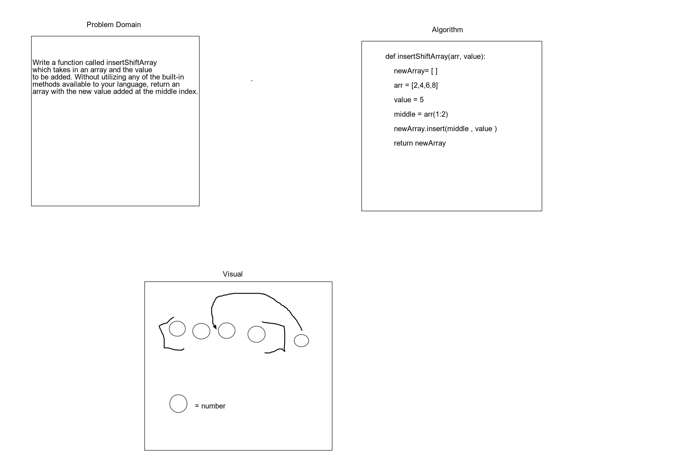

# Challenge Summary
Worked together as a pair to accomplish a white board of the code challenge for the day.

## Challenge Description
Write a function called insertShiftArray which takes in an array and the value to be added. Without utilizing any of the built-in methods available to your language, return an array with the new value added at the middle index.

## Approach & Efficiency
We took is use google and the tools we already knew and could reference from the pre-work

## Solution

