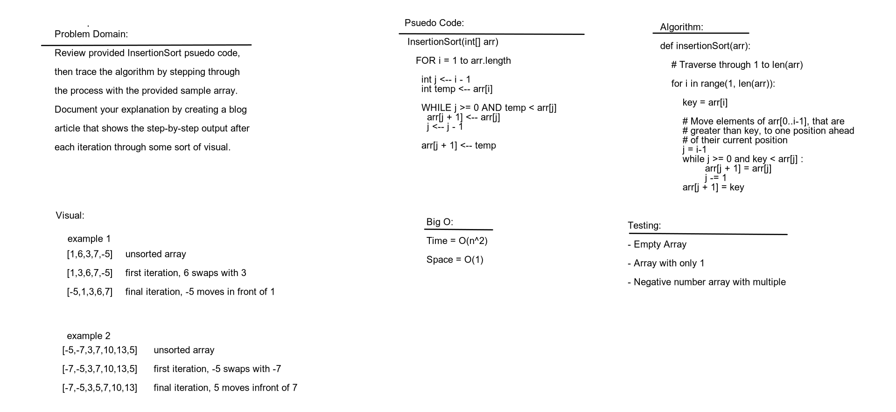

# Challenge Summary

Working as a team to complete the code challenge

## Challenge Description

Provide a visual step through for each of the sample arrays based on the provided pseudo code
Convert the pseudo-code into working code in your language
Present a complete set of working tests. Review the pseudocode below, then trace the algorithm by stepping through the process with the provided sample array. Document your explanation by creating a blog article that shows the step-by-step output after each iteration through some sort of visual. Once you are done with your article, code a working, tested implementation of Insertion Sort based on the pseudocode provided.

## Approach & Efficiency

We took the approach of whiteboarding and looking up docs on the internet to figure out the problem and made a blog type explanation. The big O for space is O(1) and for time it was O(n^2).

## Solution

