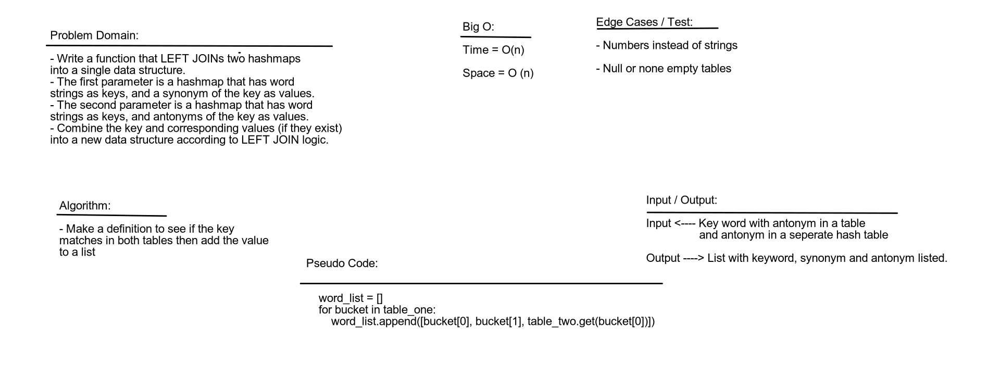

# Hashmap LEFT JOIN

Work as a pair to complete the code challenge in an efficient Big O time manner as possible.

## Challenge

- Write a function that LEFT JOINs two hashmaps into a single data structure.
- The first parameter is a hashmap that has word strings as keys, and a synonym of the key as values.
- The second parameter is a hashmap that has word strings as keys, and antonyms of the key as values.
- Combine the key and corresponding values (if they exist) into a new data structure according to LEFT JOIN logic.

## Approach & Efficiency

Problem solve and white board to figure out a solution and completly understand the problem first before starting. The Big O for time is O(n^2) and space is O(n).

## Solution

