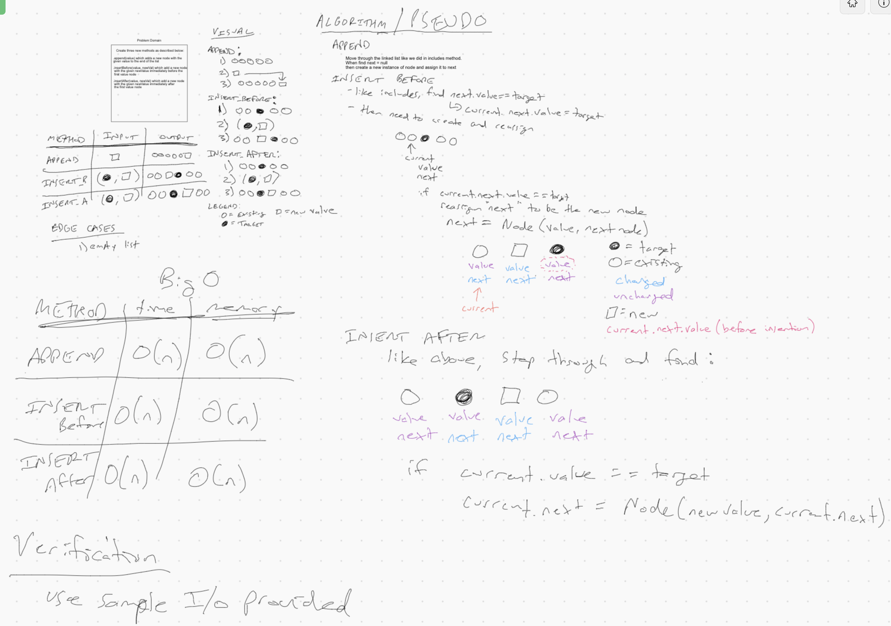
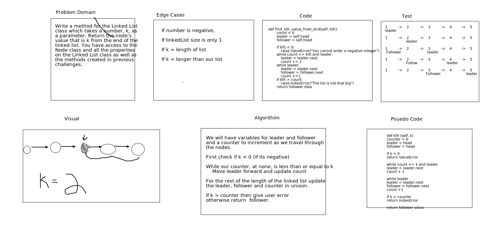

# Singly Linked List
<!-- Short summary or background information -->
Creating a list and tests to test for it

## Challenge
<!-- Description of the challenge -->

## Approach & Efficiency
<!-- What approach did you take? Why? What is the Big O space/time for this approach? -->
The approach i took was breaking down each section and building it into a whole working product. The big O for time is O(1) because no matter how many nodes you add it will always take the same amount of time to run because it reads the head of the list of nodes.

## API
<!-- Description of each method publicly available to your Linked List -->
- A Node class that has properties for the value stored in the Node, and a pointer to the next Node.
- LinkedList class, includes a head property. Upon instantiation, an empty Linked List is created.
- A method called insert which takes any value as an argument and adds a new node with that value to the head of the list with an O(1) Time performance.
- A method called includes which takes any value as an argument and returns a boolean result depending on whether that value exists as a Node’s value somewhere within the list.
- A method called __str__  which takes in no arguments and returns a string representing all the values in the Linked List, formatted as:
"{ a } -> { b } -> { c } -> NULL"

#### __Tests__

1. Can successfully instantiate an empty linked list
2. Can properly insert into the linked list
3. The head property will properly point to the first node in the linked list
4. Can properly insert multiple nodes into the linked list
5. Will return true when finding a value within the linked list that exists
6. Will return false when searching for a value in the linked list that does not exist
7. Can properly return a collection of all the values that exist in the linked list

# ll-insertions

## Challenge Summary

Work as a pair to create methods to LinkedList class to compelete challenge description and create tests to make sure it works properly

## Challenge Description

- .append(value) which adds a new node with the given value to the end of the list
- .insertBefore(value, newVal) which add a new node with the given newValue immediately before the first value node
- .insertAfter(value, newVal) which add a new node with the given newValue immediately after the first value node

## Approach & Efficiency

Approach we took was compelete the parts we knew how to do and pull it appart in chunks. This makes it easier and more managable. Big O is O(n).

## Solution

# ll-kth-from-end

 # Challenge Summary

Worked with alex to create a whiteboard example and walked through to the solution.

## Challenge Description

Write a method for the Linked List class which takes a number, k, as a parameter. Return the node’s value that is k from the end of the linked list. You have access to the Node class and all the properties on the Linked List class as well as the methods created in previous challenges.

## Approach & Efficiency

Build the white board out use leader and follower and the big O is O(n)

## Solution

