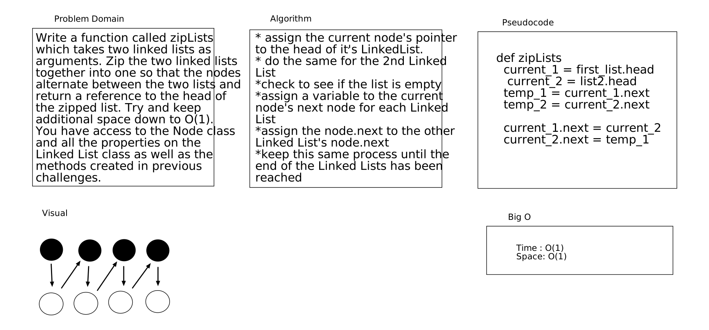

# Challenge Summary

Work as a team to create a viable product.

## Challenge Description

Write a function called zipLists which takes two linked lists as arguments. Zip the two linked lists together into one so that the nodes alternate between the two lists and return a reference to the head of the zipped list. Try and keep additional space down to O(1). You have access to the Node class and all the properties on the Linked List class as well as the methods created in previous challenges.

## Approach & Efficiency

Approach we took was compelete the parts we knew how to do and pull it appart in chunks. This makes it easier and more managable. Big O is O(1).

## Solution

