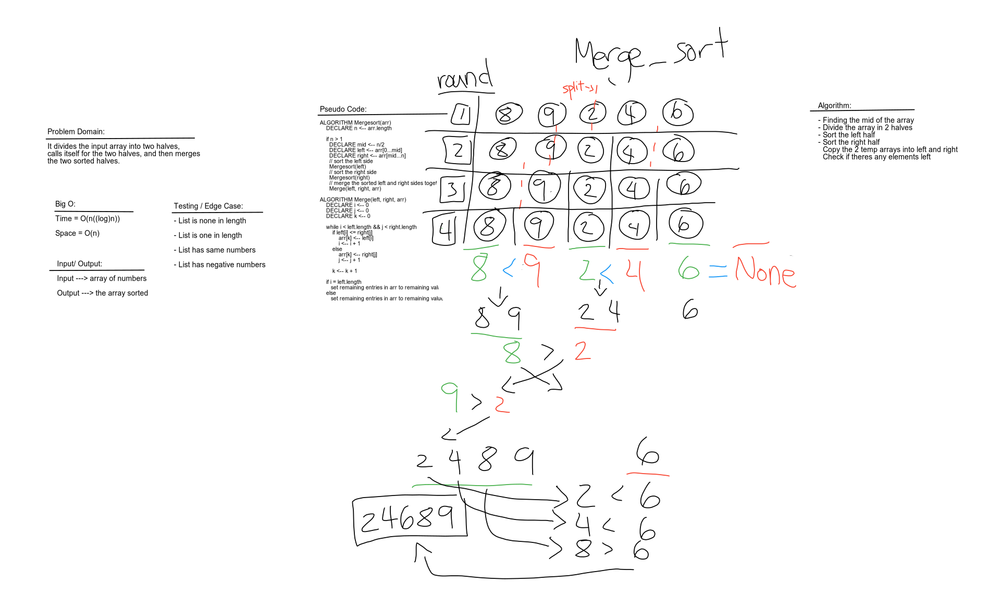

# Challenge Summary

Work as a team to complete code challenge

## Challenge Description

Review the pseudocode below, then trace the algorithm by stepping through the process with the provided sample array. Document your explanation by creating a blog article that shows the step-by-step output after each iteration through some sort of visual.

Once you are done with your article, code a working, tested implementation of Merge Sort based on the pseudocode provided.

## Approach & Efficiency

Search documentations and read articles figure out what we need to do and how to do it. White board our example then write code and tests. After create a blog explaining it.  The big O for time is O(n((log)n)) and for space its O(n).

## Solution

