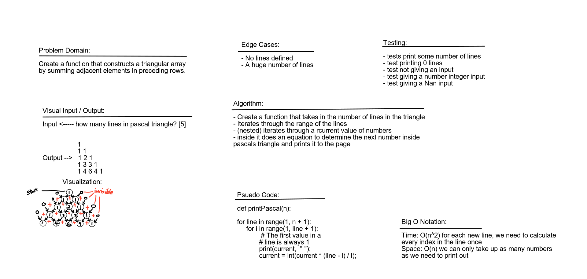

# Challenge Summary

Work as a pair to find a solution to the challange problem.

## Challenge Description

Create a function that constructs a triangular array by summing adjacent elements in preceding rows.

## Approach & Efficiency

Build out a white board and solve the challenge. Build out slowley the parts we know.  The big O for time is O(n^2) and for space is O(1)

## Solution

