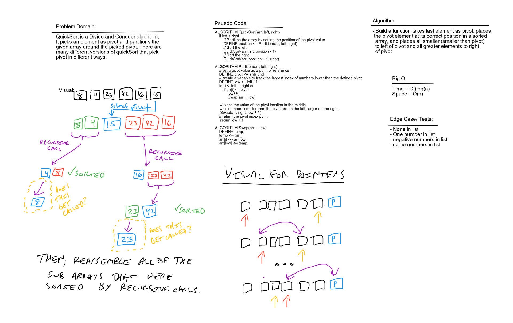

# Challenge Summary

Work together to solve a problem of creating a definition that does quicksort

## Challenge Description

Review the pseudocode below, then trace the algorithm by stepping through the process with the provided sample array. Document your explanation by creating a blog article that shows the step-by-step output after each iteration through some sort of visual.

Once you are done with your article, code a working, tested implementation of Quick Sort based on the pseudocode provided.

## Approach & Efficiency

Approach is read documents online and build an understanding of the problem domain so we can have a MVP that works how it is suppose to. The big O for time is O(log(N)) and space is O(n).

## Solution

