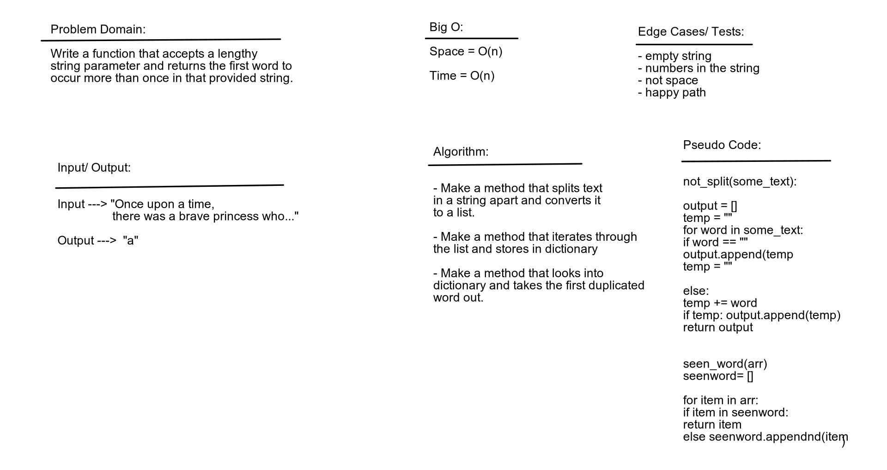

# Challenge Summary
Complete code challenge and white board in a timely manner.

## Challenge Description

Write a function that accepts a lengthy string parameter and returns the first word to occur more than once in that provided string.

## Approach & Efficiency

Figure out our approach first and determine what data structure we can use then white board it out, write out function and tests to match.  The big o for time is 0(n) and for space is O(1)

## Solution

