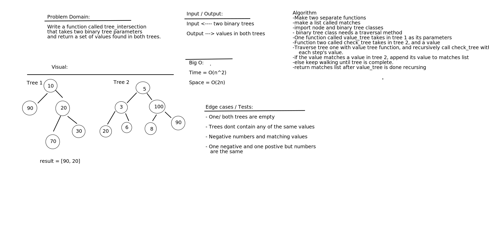

# Challenge Summary

Work together to build a white board and build definition and tests for that definition

## Challenge Description

Write a function called tree_intersection that takes two binary tree parameters and return a set of values found in both trees.

## Approach & Efficiency

Build out what we know on the white board and google the rest. The Big O for time is

## Solution

